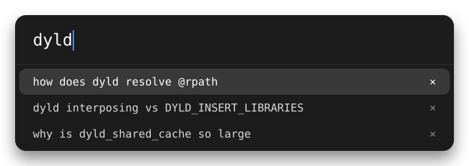
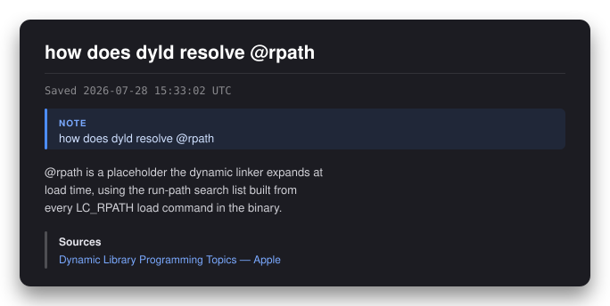
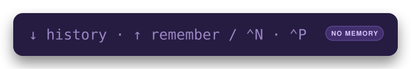

# udm50

A Spotlight-style launcher for Google AI Mode on macOS.


Press a hotkey anywhere and this drops in over whatever you were doing. Type a question,
hit Enter, and a window opens with the AI Mode answer already loading. The placeholder is
the entire keymap, so there is nothing to memorise.

AI Mode in a browser tab is just a browser tab. It gets buried behind thirty others, it
is tied to whatever account you are signed into, and getting the answer back out means
selecting text and hoping the formatting survives. This is the same product in a window
built for it.



`↓` opens your past queries, filtered by whatever you have typed, and `×` forgets one for
good. History is a file next to the app rather than a Google account: the session is
signed out by default, every permission request is denied, and the locale is pinned to
en-US. Dismiss the bar by accident and it comes back holding what you typed.

Then `⌘S` in the answer window writes the whole conversation to Markdown — headings,
lists, tables, code fences, LaTeX, answer graphics and source links intact, with each of
your turns marked as a callout so it stays obvious who said what:



It is made to be read in a Markdown viewer, not re-pasted into a chat. Links in the
answer are copied rather than opened — clicking a result puts the URL on your clipboard
instead of navigating away, so the window never stops being AI Mode.

The app is named after `udm=50`, the undocumented URL parameter that selects AI Mode.
There is a whole section about that below, because it is the single thing this app
depends on: it is a personal tool, not a product, unsigned, unpackaged, and resting on
something Google has never documented and could change without warning.

## Requirements

macOS, Node.js, and network access to Google. Everything else is vendored by Electron.

## Install and run

```bash
npm install
npm start
```

The app lives in the menu bar as a `✦` icon. There is no Dock icon until an AI Mode
window is open. It stores everything inside the project directory, not in
`~/Library` — cookies and cache in `.userdata/`, query history in `transcript/`. Both
are gitignored. Deleting `.userdata/` resets the app completely.

Source lives in `src/` (`main.js` is the Electron main process; `*_preload.js` and the
HTML files are the renderer side), and the SVGs in this README are in `assets/`.

## Using it

Default hotkey is `⌘⇧Space`, with `⌥Space` as a fallback if that one is already taken.
Both are configurable in Settings, and either can be disabled in favour of the menu bar.

### The launcher bar

| Key | Does |
|---|---|
| `Enter` | Ask the question |
| `↓` or `⌃N` | Open query history; move down it |
| `↑` or `⌃P` | Toggle forget mode; move up the history list when it is open |
| `Esc` | Close the history list, then clear the box, then dismiss |
| `⌘Z` | Bring back a query you cleared before dismissing; otherwise ordinary undo |
| `Delete` or `⌘⌫` | Remove the highlighted row from history |
| `⌘,` | Settings |
| `⌘W` or `⌘Q` | Dismiss the bar (the app keeps running) |

The bar comes back holding whatever was in it when it went away, selected, so typing
replaces it and a fresh question costs no extra keystroke. History keeps the last 200
queries and filters as you type.

### The AI Mode window

| Key | Does |
|---|---|
| `⌘S` | Save the conversation as Markdown (first time asks where; after that it is silent) |
| `⌘⇧S` | Save As |
| `⌘F` | Find in page. `⌘G` and `⌘⇧G` step through matches, `Esc` closes |
| `⌃⌘D` | Look up the selected word in the macOS dictionary |
| `⌘W` or `⌘Q` | Close the window |
| `Space`, `PageUp`, `PageDown` | Page through the answer, keeping a line of overlap |
| Middle-click | Firefox-style autoscroll |

Right-click gives you Copy Link, image copy and save, Look Up, and — once you have saved
this conversation — Show Saved Transcript, which reveals the file in Finder.

Pressing the hotkey while a window is open switches to it rather than opening a second
one. Use the menu bar item to start a new conversation.

### Saving a conversation

`⌘S` writes a Markdown file named for the date and your opening question. The capture
walks the page's DOM rather than scraping text, so structure survives: MathML becomes
LaTeX, answer graphics are decoded into a sibling `_files/` folder and linked
relatively, and Google's source rails become a labelled blockquote instead of looking
like something the model said. Each of your turns is a `> [!NOTE]` callout, which
renders as a coloured box in GitHub-flavoured viewers.

Saving is opt-in per conversation. Nothing is written unless you press `⌘S`.

### Forget mode

**This is not private browsing, and it is not incognito mode. Do not use it as one.**

Incognito means an empty cookie jar — you are logged out, and the session starts as a
stranger. This does the opposite: it deliberately copies your existing Google cookies
into the session, because a session Google has never seen gets served a CAPTCHA instead
of an answer. Same IP, same request, same identity cookie. **Google can link a query
asked this way to your ordinary session exactly as before, and nothing about this mode
changes that.**

What it actually does is stop *this app* writing the query down. It skips your query
history, it is left out of the draft the bar remembers, and its cookies and cache live in
memory only and die with the window. That is the whole of it: a local housekeeping
setting, useful when you would rather a question not sit in a list on your own machine.

"Off the record" in the journalistic sense — they hear you perfectly well, nobody writes
it down. If you need Google not to know, that is a VPN or Tor problem, and this app
cannot help.

Press `↑` in the launcher to turn it on. The bar turns indigo, both it and the answer
window show a `NO MEMORY` badge, and the hint flips to `↑ remember`:



The mode sticks until you turn it off, but resets to normal when the app restarts.

## Settings

`⌘,` or the menu bar. Hotkey and fallback, whether to remember the answer window's size
and position, a cap on how much page cache is kept on disk, buttons to clear cache and
cookies, and whether to rewrite `reddit.com` links to `old.reddit.com` when copying.

Clearing cookies also clears what makes Google treat this app as a returning browser, so
expect to solve an "unusual traffic" CAPTCHA afterwards.

## How it works

One principle runs through the whole design, and it is worth stating because it explains
most of the decisions:

- **Your side is durable.** The launcher, the window shell, hotkeys, transcript files,
  link routing, anything this app renders itself. Plain Electron and DOM. Google cannot
  break it.
- **Google's side is brittle.** Anything reaching into the AI Mode page — extracting the
  answer, reading their structure. AI Mode runs live experiments and changes without
  notice, so everything selector-dependent is quarantined and written to degrade quietly.

Concretely, the transcript walker never names a Google class or ID. It finds the answer
by peeling wrapper elements until the content fans out, and it captures your questions by
reading the focused element at submit time rather than by parsing their DOM.

The app also watches every load and, if a query comes back as ordinary web results
instead of an answer, shows a copy-pasteable report rather than silently pretending. That
check is deliberately biased toward assuming things are fine: only positive evidence of a
normal results page counts as a failure, because a Google URL change that still serves AI
Mode must never blank out a working page.

## The udm=50 parameter

Every query is `https://www.google.com/search?q=...&udm=50`. That parameter is
undocumented, reverse-engineered, and load-bearing. If AI Mode ever stops loading, it is
the first suspect.

### What udm stands for

The only expansion in any Google-authored artifact is **"Unified Drilldown Mode"**, from
a Chromium source comment:

```cpp
// The value for the "udm" (Unified Drilldown Mode) query parameter.
// value "50" triggers AI mode as opposed to traditional search.
constexpr char kAIMDisplayMode[] = "50";
```

Corroborated in an unrelated subsystem by `kUnifiedDrillDownQueryParameter[] = "udm"` in
`components/lens/lens_url_utils.h`, with different casing, suggesting two authors rather
than a copy-paste.

Treat it as the best-attested guess, not fact: it is one browser engineer's inline
comment rather than a Search team document, and it entered Chromium after the parameter
had already become a public curiosity, so it is not independent attestation.

**"User Display Mode", the expansion most of the web repeats, is folklore.** It traces to
a single SEO post that says of itself "we can only speculate" and "I suspect".

### Why 50

Nobody knows, and no source of any quality even attempts an answer. The value space
behaves like a sparse, allocation-ordered enum — related surfaces sit adjacent, most
integers below 60 render an ordinary results page, values above roughly 60 get stripped.
The likeliest answer is that 50 was simply the next free identifier when AI Mode shipped.

### Known values

Named in Google-authored code:

| Value | Surface |
|---|---|
| `udm=50` | AI Mode |
| `udm=28` | Shopping |
| `udm=26` | Lens, image query with no text |
| `udm=24` | Lens, image query with text |

Attested only by community reverse-engineering, and correspondingly less trustworthy:
`14` web-only links, `2` images, `7` videos, `12` news, `18` forums, `36` books,
`39` short video, `44` visual matches, `48` exact matches.

### Traps

- **Do not grep Chromium for "UDM" and trust the result.** There is an unrelated
  `UserDisplayMode` in the desktop-PWA subsystem, abbreviated the same way. It almost
  certainly explains how people "confirm" the User Display Mode rumour.
- **"Unified Data Model" is a real Google acronym for the wrong product** — it belongs to
  Google Security Operations, so searching Google's own docs returns authoritative pages
  about something else entirely.
- **`aep=48` is not `udm=48`.** They sit next to each other in Chromium's AI Mode URL and
  mean unrelated things. `aep` records which entry point you arrived from; it is not a
  surface selector and must not be substituted for `udm`.
- **`udm=50` is AI Mode, not AI Overviews** — the conversational surface, not the summary
  block above ordinary results.

## Stability and risk

Google has never documented this URL grammar and does not treat it as public API. For
contrast, it does spell out abbreviations in parameters it chooses to document: `hl` is
"host language", `lr` is "language restrict". Nothing like that exists for `udm`.

Precedent for silent breakage: `num`, which *is* formally documented, was quietly
disabled in September 2025 with no announcement and no error. Values rot too — `udm=56`
appeared in mid-2025 and was being called deprecated within two months.

Checked 2026-07-28: `udm=50` is current. Chromium ships the omnibox AI Mode URL with it,
`g.ai` still redirects to it, and this app uses it daily. That is a statement about today.

## Development

```bash
npm start                    # run it
node .scratch/test_walker.js # transcript walker tests, 20 assertions
```

The walker tests run the real preload against stub DOM trees, so they cover the
Markdown conversion without needing a live page. `⌘⇧D` in an AI Mode window dumps the
answer DOM outline next to your transcripts, which is how new page-structure surprises
get diagnosed.

`DEBUG_SUMMON` in `src/main.js` turns on timestamped window-activation tracing. It is off by
default and worth flipping on if focus or Space-switching behaves oddly.

Everything the app logs is also appended to `.userdata/diagnostics.log`, which is where to look
when something has already happened and the terminal no longer remembers it. Regardless of
`DEBUG_SUMMON`, that file records who initiated a quit (with a stack trace), every main-process
exception, and each time the AI Mode window closed — enough to tell "I closed the window" apart
from "something quit the app". It rotates to `.log.1` past 512 KB.

## Sources

- https://raw.githubusercontent.com/chromium/chromium/main/chrome/browser/ui/webui/new_tab_page/new_tab_page_ui.cc
- https://raw.githubusercontent.com/chromium/chromium/main/components/lens/lens_url_utils.h
- https://raw.githubusercontent.com/chromium/chromium/main/components/search_engines/template_url_starter_pack_data.cc
- https://serpapi.com/blog/every-google-udm-in-the-world/
- https://raw.githubusercontent.com/obsidianforensics/unfurl/main/unfurl/parsers/parse_google.py
- https://tedium.co/2024/05/17/google-web-search-make-default/

## Known gaps

Things that are genuinely unfinished, rather than decided against.

**Forget mode's cookie seeding is believed fixed, not confirmed.** The first version copied
only `GOOGLE_ABUSE_EXEMPTION`, on the theory that it was the token keeping Google's CAPTCHA
away. It is not — inspecting the real jar showed no such cookie exists at all, because
Google only issues it once you have solved a CAPTCHA. What actually carries the session is
the ordinary `google.com` jar, so seeding now copies that instead. That change has not been
run yet. The tell is a line on stdout — and in `.userdata/diagnostics.log` — at the first
forget-mode query:

```
[private] seeded 8/8 google.com cookies
```

If it reports `0`, seeding is still failing and the diagnosis was wrong somewhere. If it
reports a healthy number and you still get a CAPTCHA, the cookies are not sufficient and
something else marks the session as automated.

**The cookie set has never been narrowed.** Copying the whole jar includes `NID`, a stable
identifier, which is the specific reason forget mode cannot claim to be private. Whether a
smaller set — `AEC` and `SNID` and `__Secure-STRP`, dropping `NID` — still gets past the
gate is untested. If it does, forget mode gets meaningfully less linkable for free. The
failure mode of trying is a CAPTCHA, not a broken app. See `seedPrivateCookies` in
`src/main.js`.

**The load-health check has no positive signal.** It can recognise an ordinary results page
and treat that as failure, but it cannot recognise an AI Mode answer and treat that as
success. So it catches the common degradation and stays silent on unknown ones, which is
the intended bias — but a positive tell would be strictly better, and picking a selector
that would not itself rot needs a look at the live DOM first.

## License

MIT. See [LICENSE](LICENSE).
